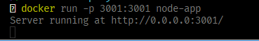
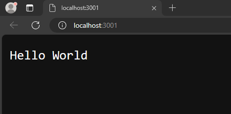
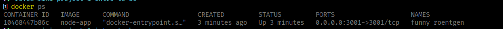

# Mini Project: Intro to Backend

## Objective
```Dockerize a simple Node.js application```

## Steps to be followed
### Notes
- Make sure you have followed the steps mentioned in the previous task to install docker on your machine.

### Steps

1. In the root directory of your project, create a new file named `Dockerfile` and add the following content:
```Dockerfile```

2. Open the `Dockerfile` and add the following content:
```Dockerfile
# Use the official image as a parent image
FROM node:14-alpine

# Set the working directory
WORKDIR /app

# Copy the file from your host to your current location
COPY . .

# Inform Docker that the container is listening on the specified port at runtime.
EXPOSE 3001

# Run the specified command within the container.
CMD [ "node", "app.js" ]
```

3. Open the terminal to build the Docker image. Run the following command:
```bash
docker build -t node-app .
```

4. After the image is built, run the following command to start the container:
```bash
docker run -p 3001:3001 node-app
```
5. If you want to run the container in the background, you can use the following command, with the `-d` flag to detach the container:

```bash
docker run -d -p 3001:3001 node-app
```

6. After run the container, you should see the following output:



7. Open your browser and navigate to `http://localhost:3001` to see the application running. You should see the following output:



8. You can use the following command to verify the running container:
```bash
docker ps
```

9. You should see the following output:



10. To stop the container, you can use the following command. You can replace `<container_id>` with the actual container ID that you obtained from the previous command:
```bash
docker stop <container_id>
```